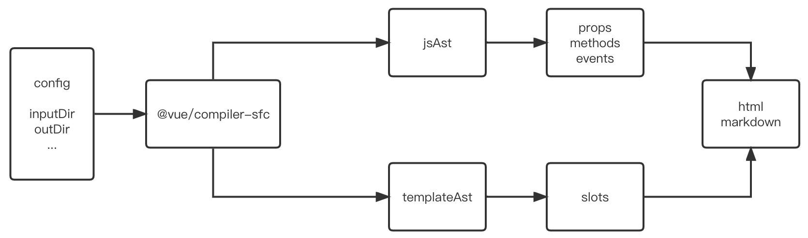

vue sfc 文档生成器
========================
通过遍历 .vue 文件代码的 AST，找出其中的 prop/method/event/slot 及其对应的注释，返回结果数据或直接用于生成 HTML 文档。

# 安装使用
```
tnpm i -D @tencent/doc-generator-vue3
```
```javascript
// 扫描 components 目录下的所有 .vue 文件并输出文档到 docs 目录下，HTML 文档标题为 'My Components'
require('@tencent/doc-generator-vue3').build({
  inputDir: './components',
  outDir: './docs',
  docTitle: 'My Components',
});

// 扫描 components 目录下的所有 .vue 文件，返回结果
const result = require('@tencent/doc-generator-vue3').scanFold('./components');

// 扫描文件 components/comp.vue 并返回结果
const result = require('@tencent/doc-generator-vue3').scanFile('./components/comp.vue');

// 扫描传入的源码 并返回结果
const result = require('@tencent/doc-generator-vue3').scanContent(
  require('fs').readFileSync('./components/comp.vue', 'utf-8')
);
```

# 流程原理


使用 @vue/compiler-sfc 对指定的 .vue 文件进行编译，得到 js 和 template 的 AST。AST 里每个语句都对应一个节点，如果该语句写有注释，该注释会包含在节点里。

## props的查找
1. 在 AST 里找到位于顶层上下文的 `export default` 语句，拿到对组件的描述对象（即 vue 文档中所称的“选项”），有这个对象就可以找到 props 字段的值，遍历即可找出所有 props。
2. 对于`<script setup>`，在 AST 里找到位于顶层上下文的 `defineProps()` 或者 `const props = defineProps()` 调用，拿到它的 arguments，遍历即可。

## methods的查找
1. 类似于 props 的查找，找到组件选项对象的 methods 字段即可。methods 里可能大多数方法都是私有的，因此需要检查方法的注释里是有带有`@method`标识，有则视为一个暴露出去的方法。
2. 对于 `<script setup>`，在 AST 里找到位于顶层上下文的 `defineExpose()`调用，那到它的 arguments，遍历即可。defineExpose 里的方法，其定义的地方可能是在 defineExpose 之外，所以还要记录下同一个闭包里声明的函数，与 defineExpose 里的 key 做比对。
3. 查找 setup 函数里暴露的方法与`<script setup>`，但需要根据函数第二个参数找到 caller。

## events的查找
因为 events 可以调用在代码的任何角落里，因此无论是 setup 函数还是 `<script setup>`，都需要用 @babel/traverse 来遍历 AST 节点树。
1. 对于使用选项的代码，直接查找 `this.$emit()` 的调用即可
2. 对于`<script setup>`，找到 `const emit = defineEmits()` 的调用，然后遍历 AST 查找 `emit('some-event')` 的调用即可。

## 存在的问题
显然上述查找方法并不严谨，例如：
1. 遍历到的 emit('')可能并不是 `defineEmits` 的返回值，而是在某个上下文里新定义的对象。
2. expose 里的方法定义在 expose 之外时，只能识别固定的语法，而一些灵活写法识别比较麻烦，例如：
```javascript
const fn = () => 1
expose({
  fn, // ok
})


let fn;
if (flag) {
  fn = () => 1;
} else {
  fn = () => 2;
}
expose({
  fn, // 无法识别出 fn 方法
})
```
对这些灵活写法的支持，可以作为后续优化的方向。

# API
```javascript
type Prop = {
  name: string,
  type: string,
  desc: string,
  default: string,
  required: string,
}
type Param = {
  name: string,
  desc: string,
  defaultValue?: string,
  optional?: boolean,
  type: string[],
}
type Method = {
  name: string,
  desc: string,
  params: Param[],
}
type Event = {
  name: string,
  desc: string,
  params: Param[],
}
type Slot = {
  name: string,
  desc: string,
}
type Result = {
  name: string, // 组件名称
  desc: string, // 组件的描述注释
  props: Prop[],
  methods: Method[],
  events: Event[],
  slots: Slot[],
}

// 扫描目标文件夹中的 .vue 文件，返回扫描结果。
function scanFold(path: string): Result[]

// 扫描目标文件，返回扫描结果。
function scanFile(path: string): Result

// 扫描目标内容，返回扫描结果。
function scanContent(content: string): Result

// 扫描目标文件夹，使用结果数据生成HTML文档。
function build(options: {
  inputDir: string, // 此目录下的 .vue 文件都会被扫描
  outDir: string, // 生成的结果文档输出到的目标文件夹
  docTitle: string, // 生成的 HTML 文档的 title
}): void

```

# 扫描内容
## prop
```javascript
defineProps({
  // a desc
  a: String,
  /**
   * b desc
   */
  b: {
    type: Number,
    default: 2,
    required: true,
  }
})
export default {
  props: {
    // a desc
    a: String,
    /**
     * b desc
     */
    b: {
      type: Number,
      default: 2,
      required: true,
    }
  }
}
```
## method
```javascript
export default {
  setup(props, ctx) {
    // e desc
    const e = () => {}
    ctx.expose({
      e,
      // f desc
      f() {},
    })
  },
  setup(props, { expose }) {
    expose({
      g() {},
    })
  },
  methods: {
    /**
     * @method
     * `methods`选项里的方法，需要加上上面`@mothod`标记才会被扫描出来，因为有很多方法是私有的
     * 可以换行
     * @param {string|number} paramA paramA的注释
     * @param {object} paramB paramB的注释，其字段a/b写在下方
     * @param {number} paramB.a paramB.a的注释
     * @param {number} paramB.b paramB.b的注释
     * @param {string} [paramC='asd'] paramC的注释，可选，默认值为'asd'
     */
    a(paramA, paramB, paramC) {},
    /**
     * 不会被扫描出来
     */
    b() {},
  }
}

function c() {}
// d desc
const d = () => {}

defineExpose({
  /**
   * a desc
   */
  a() {},
  // b desc
  b() {},
  // c desc
  c,
  d,
})
```
## event
```javascript
export default {
  mounted() {
    // ev-a desc
    this.$emit('ev-a', paramA)
  },
  methods: {
    a() {
      const event = 'ev-b';
      /**
       * @event ev-b
       * 事件ev-b desc
       * 如果 $emit 的第一个参数不是字符串字面量，需要在注释里加上 `@event eventName`来指定事件名
       * @param {string} paramA 参数paramA
       */
      this.$emit(event);
    }
  }
}

const emit = defineEmits();

onMounted() {
  // ev-c desc
  emit('ev-c');
}

defineExpose({
  a() {
    emit('ev-d');
  }
})
```

# TODO
* api 提供更丰富的使用参数。
* 字段不要全部是 string ，转 string 的操作应交给 html 渲染器。
* 项目在搭建时没有去做架构设计，文件、代码结构还有待优化。
* 没有支持一些少见的写法，详见单测。
* 支持cli。

# 备忘
之前使用 jsdoc 的问题：
1. jsdoc生成的 json 难以阅读
2. 不能扫描到没有注释的 prop/method/event
3. 难以识别一个有注释的函数是否是一个 method
